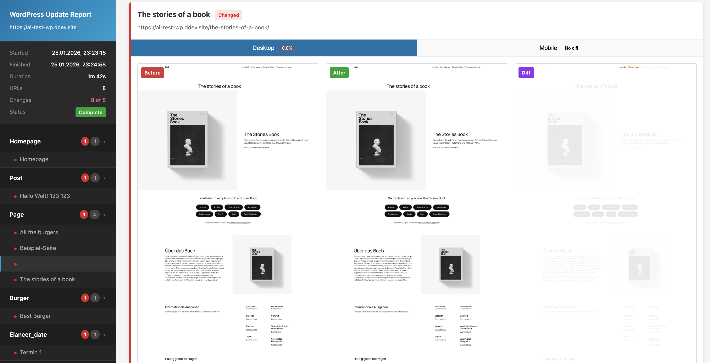

# WordPress Pixel Police

A CLI tool that captures before/after screenshots of WordPress websites to track visual changes during updates. Perfect for verifying that plugin, theme, or core updates don't break your site's appearance.

The tool automatically discovers all public post types (pages, posts, and custom post types) via the WordPress REST API and screenshots 5 random posts from the last 20 entries of each post type.

> **Note:** This project was vibe coded with Claude Code.



## Features

- **Automatic URL Discovery** - Uses WordPress REST API to find all public pages and posts
- **Dual Viewport Capture** - Screenshots at desktop (1920x1080) and mobile (390x844) sizes
- **Visual Diff Generation** - Pixel-by-pixel comparison highlighting exactly what changed
- **Interactive HTML Report** - Browse results with sidebar navigation, viewport tabs, and lightbox
- **Local Dev Support** - Works with .ddev.site, .local, .test, .localhost, and other local environments

## Installation

```bash
# Clone the repository
git clone <repo-url>
cd wordpress-wartung

# Install dependencies
npm install

# Install Playwright browser (required first time)
npx playwright install chromium
```

## Usage

```bash
npm start
# or
npm run dev
```

## Workflow

The tool guides you through a simple interactive workflow:

### 1. Enter WordPress URL

Provide your WordPress site URL (e.g., `example.com` or `https://example.com`). The tool automatically detects local development sites and handles SSL certificates.

### 2. API Discovery

The tool checks if the WordPress REST API is accessible. If available, it fetches all public post types.

### 3. Select Post Types

Choose which post types to include in screenshots (pages, posts, custom post types). All are selected by default - use space to toggle and enter to confirm.

### 4. BEFORE Screenshots

The tool captures full-page screenshots of the homepage plus up to 5 random posts from each selected post type, at both desktop and mobile viewports.

### 5. Perform Your Update

You're prompted to perform your WordPress update (plugins, themes, core, etc.). An interim report is available to review the before screenshots.

### 6. AFTER Screenshots

Once you confirm the update is complete, the tool captures the same pages again.

### 7. Visual Diff & Report

The tool generates pixel-diff images highlighting changes and creates an HTML report. Changed pixels appear in red, making it easy to spot differences.

### 8. Review Results

The report opens in your browser. Navigate through pages in the sidebar, switch between desktop/mobile views, and click images to zoom.

## Report Features

- **Sidebar Navigation** - Browse all captured pages organized by post type
- **Viewport Tabs** - Toggle between desktop and mobile screenshots
- **Before/After/Diff Views** - Compare original, updated, and difference images
- **Lightbox** - Click any image to view full-size
- **Change Summary** - See pixel count and percentage of changes per page

## Project Structure

```
output/
└── {date}_{domain}/
    ├── before/          # Original screenshots
    ├── after/           # Post-update screenshots
    ├── diff/            # Visual diff images
    └── report.html      # Interactive HTML report
```

## Technical Details

- Built with TypeScript and Playwright
- Uses pixelmatch for image comparison
- Scrolls pages during capture to trigger lazy-loaded content
- Handles different image dimensions by padding with white
- 60-second timeout per page load with `networkidle` wait state
